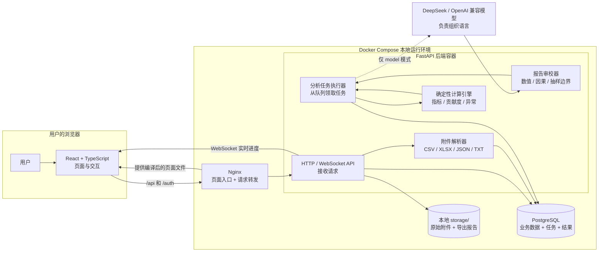
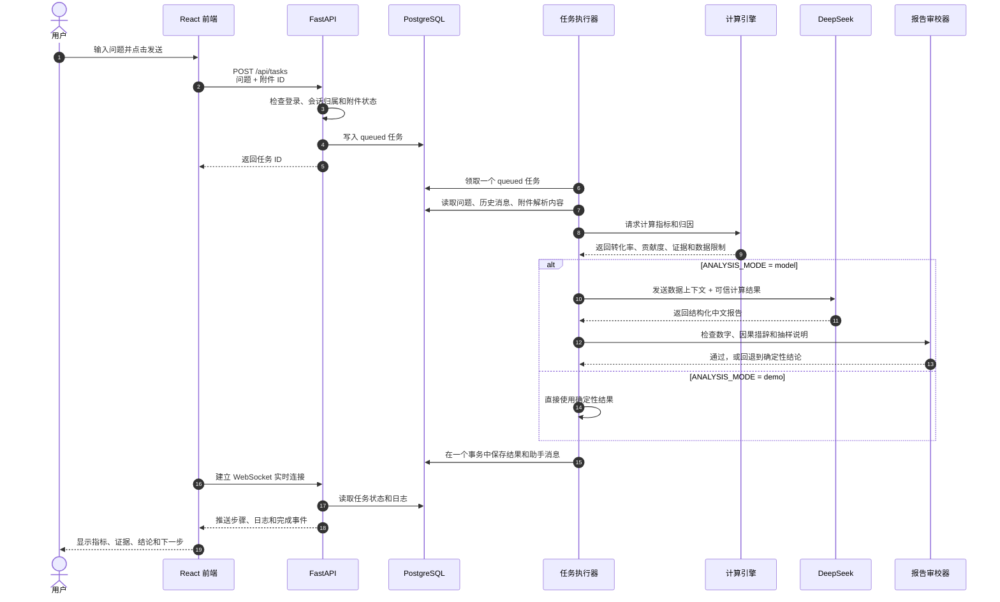
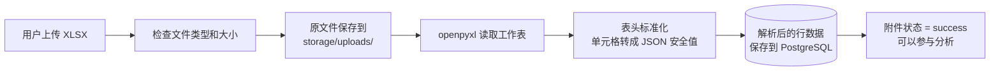
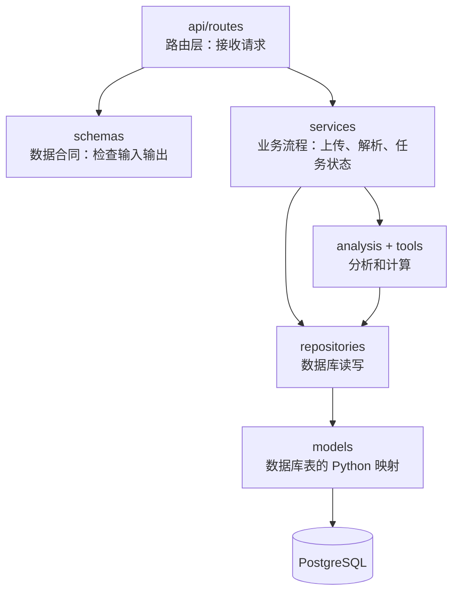
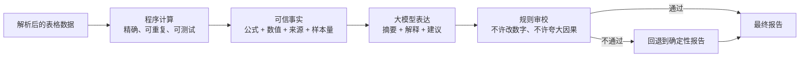
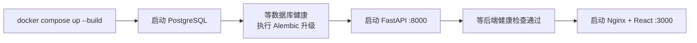

# InsightTrace 架构图与入门说明

> 这份文档面向刚开始学代码的同学。你不需要先理解所有技术名词，只要先记住一句话：
>
> **前端负责和用户交流，后端负责办事，数据库负责记账，文件目录负责放文件，大模型负责表达，程序负责计算和审核。**

## 1. 项目是做什么的？

InsightTrace 是一个经营数据分析系统。用户可以：

1. 登录系统；
2. 新建一个分析会话；
3. 上传 CSV、XLSX、JSON 或 TXT 文件；
4. 输入“为什么 8 月转化率下降？”这类问题；
5. 看到指标、证据、结论、数据限制和下一步建议；
6. 导出 Markdown 分析报告。

## 2. 系统总览图



### 把它想象成一家餐厅

| 项目组件 | 餐厅比喻 | 它实际做什么 |
|---|---|---|
| React 前端 | 前台服务员 | 展示页面，收集问题和文件，展示结果 |
| Nginx | 门口接待 | 把页面交给浏览器，把 API 请求转给后端 |
| FastAPI | 大堂经理 | 检查登录和参数，把事情分派给对应模块 |
| 任务执行器 | 后厨调度员 | 从数据库中找到排队任务，按步骤完成分析 |
| 确定性计算引擎 | 厨房电子秤 | 用程序计算转化率、贡献度和排名，保证数字可复算 |
| 大模型 | 文案编辑 | 把计算结果组织成更好读的文字，不是数字的最终裁判者 |
| 报告审校器 | 出餐检查员 | 防止模型改数字、过度归因或忽略抽样限制 |
| PostgreSQL | 餐厅账本 | 保存用户、会话、任务、日志、解析数据和分析结果 |
| `storage/` | 文件柜 | 保存用户上传的原始文件和导出的 Markdown 报告 |

## 3. 用户问一个问题时，系统经历了什么？



### 为什么不在用户点击后立刻同步调用模型？

大模型可能需要几秒到几十秒。如果一个 HTTP 请求一直等待，浏览器更容易超时，用户也看不到进度。

因此系统先在数据库里建立一个 `queued` 任务，再由后台执行器处理。前端通过 WebSocket 获取实时进度。

## 4. 上传 Excel 时发生了什么？



这里有两份内容，很容易混淆：

- **原始文件**：保存在 `storage/uploads/`，用于下载和留档。
- **解析后的数据**：保存在 PostgreSQL 的附件记录中，后续计算引擎实际读的是这份结构化数据。

## 5. 后端代码是怎样分层的？



分层不是为了显得高级，而是为了避免把所有代码写在一个文件里。

### 各层职责和例子

| 目录 | 负责什么 | 例子 |
|---|---|---|
| `backend/app/api/routes/` | 定义 URL、HTTP 方法和权限检查 | `tasks.py` 创建、取消、重试分析任务 |
| `backend/app/schemas/` | 定义请求和响应应该长什么样 | `task.py` 规定问题、附件 ID 和任务状态 |
| `backend/app/services/` | 组织一个完整业务流程 | `attachment_parsing.py` 解析上传文件 |
| `backend/app/repositories/` | 封装常用的数据库查询 | `tasks.py` 查询和保存任务 |
| `backend/app/models/` | 定义 PostgreSQL 中的表和关系 | `analysis.py` 定义任务、日志和结果 |
| `backend/app/tasks/` | 负责后台任务的领取和执行 | `executor.py` 是整条分析链的“总指挥” |
| `backend/app/analysis/` | 实现分析场景、归因、模型调用和审核 | `attachment.py`、`audit.py` |
| `backend/app/tools/` | 提供可复用的底层工具 | `metrics.py` 负责分组、求和、比率计算 |
| `backend/app/core/` | 配置、异常、日志、中间件和存储边界 | `config.py` 读取 `.env` |

## 6. 分析引擎为什么又有程序、又有大模型？



这是本项目最重要的设计：

- **程序擅长算数**：例如 `下单量 ÷ 点击量`、按商品分组求和、计算漏斗贡献。
- **大模型擅长写人话**：它可以把结果组织成摘要，但不能随意改写程序计算的数字。
- **审校器负责兜底**：模型如果添加无法溯源的数字，或把“相关”写成“已证明因果”，系统会放弃那段模型文字。

## 7. 数据都放在哪里？

| 数据 | 保存位置 | 为什么放这里 |
|---|---|---|
| 用户和角色 | PostgreSQL | 需要查询、权限校验和关联其他数据 |
| 会话和消息 | PostgreSQL | 支持多轮分析和历史回放 |
| 附件元数据 | PostgreSQL | 记录文件名、大小、解析状态和归属会话 |
| 附件解析后的行 | PostgreSQL JSONB | 方便分析引擎直接读取结构化数据 |
| 原始上传文件 | `storage/uploads/` | 大文件不适合直接塞进关系表 |
| 分析任务和日志 | PostgreSQL | 任务重试、状态追踪和 WebSocket 都需要它 |
| 结构化结果 | PostgreSQL | 页面要分开展示指标、证据、结论和建议 |
| 导出的 Markdown | `storage/exports/` | 方便生成和下载实体文件 |
| API Key | 后端环境变量 | 不允许出现在前端代码、数据库记录或 Git 仓库中 |

## 8. 安全边界

即使是学习项目，以下边界也很重要：

- 后端通过签名 Cookie 识别登录用户。
- 每次读写会话、附件、任务和结果时，都会检查数据是否属于当前用户。
- 上传接口限制文件类型、单文件大小、会话总大小、行数、列数和工作表数。
- SQL 工具只允许执行白名单内的只读查询，并且有超时和返回行限制。
- WebSocket 使用短时、一次性令牌，避免长期凭据暴露。
- 附件中的文字被当作不可信数据，不能覆盖系统指令。
- 大模型生成的数字和归因措辞会再经过报告审校器。

## 9. 项目目录地图

```text
InsightTrace/
├─ frontend/                  # 浏览器页面
│  ├─ src/api/               # 调用后端 API
│  ├─ src/components/        # 会话、附件、任务、结果组件
│  ├─ src/App.tsx            # 前端总入口
│  ├─ src/styles.css         # 页面样式
│  └─ nginx.conf            # 静态页面服务和 API 转发
├─ backend/
│  ├─ app/main.py            # FastAPI 总入口，启动后台任务执行器
│  ├─ app/api/routes/        # HTTP 和 WebSocket 接口
│  ├─ app/tasks/executor.py  # 分析任务总流程
│  ├─ app/analysis/          # 归因、模型调用和报告审校
│  ├─ app/tools/             # 指标计算和安全 SQL 工具
│  ├─ app/services/          # 附件解析、任务状态、结果导出
│  ├─ app/repositories/      # 数据库查询
│  ├─ app/models/            # SQLAlchemy 数据库模型
│  ├─ app/schemas/           # Pydantic 输入输出模型
│  ├─ alembic/               # 数据库结构升级脚本
│  └─ tests/                 # 后端测试
├─ database/init/             # PostgreSQL 初始化脚本
├─ storage/                   # 上传、导出和临时文件
├─ docker-compose.yml         # 一次启动前端、后端和数据库
└─ .env                       # 本地私密配置，不提交 Git
```

## 10. 想修改某个功能，应该去哪里？

| 你想做的事 | 首先查看 |
|---|---|
| 改页面布局或文字 | `frontend/src/components/` 和 `frontend/src/styles.css` |
| 改前端请求参数 | `frontend/src/api/` |
| 增加一个 API | `backend/app/api/routes/` + `backend/app/schemas/` |
| 修改上传解析 | `backend/app/services/attachment_parsing.py` |
| 增加指标计算方式 | `backend/app/tools/metrics.py` |
| 修改 Excel 漏斗归因 | `backend/app/analysis/attachment.py` |
| 修改模型调用和提示词 | `backend/app/analysis/providers/openai_compatible.py` |
| 修改报告审核规则 | `backend/app/analysis/audit.py` |
| 修改整条分析流程 | `backend/app/tasks/executor.py` |
| 改数据库表 | `backend/app/models/` + 新的 Alembic 迁移 |
| 改环境变量 | `.env.example` + `backend/app/core/config.py` + `docker-compose.yml` |

## 11. 本地启动时，Docker 做了什么？



常用地址：

- 项目页面：<http://localhost:3000>
- API 文档：<http://localhost:8000/docs>
- 后端存活检查：<http://localhost:8000/health/live>
- 后端就绪检查：<http://localhost:8000/health/ready>

## 12. 当前架构的边界

这套架构很适合本地学习、演示和 MVP，但它还不是大规模生产集群：

1. **任务执行器和 API 在同一个后端进程中**。结构简单，但大量并发时应拆成独立 Worker。
2. **任务队列使用 PostgreSQL**，没有引入 Redis、RabbitMQ 或 Celery。对当前规模足够，也更方便学习。
3. **附件保存在本机磁盘**。多台服务器部署时需要改为共享对象存储。
4. **WebSocket 通过定时读取数据库日志获取事件**。实现可靠直观，但高并发时可以升级为专用消息通道。
5. **确定性附件归因目前主要支持可识别字段的两期漏斗表**。其他业务表会安全回退，但如果想要精确归因，仍需要增加对应的指标定义。

## 13. 初学者建议的阅读顺序

不要一开始就遍历整个项目。按下面的顺序看，比较容易建立全局感：

1. `docker-compose.yml`：先看整个系统有哪些服务。
2. `frontend/src/App.tsx`：看页面总入口。
3. `frontend/src/components/ConversationWorkspace.tsx`：看主工作台如何组合。
4. `backend/app/main.py`：看后端如何启动。
5. `backend/app/api/router.py`：看所有 API 怎样集合。
6. `backend/app/api/routes/tasks.py`：看用户如何创建任务。
7. `backend/app/tasks/executor.py`：看任务怎样被执行。
8. `backend/app/analysis/attachment.py`：看指标和贡献度怎样计算。
9. `backend/app/analysis/audit.py`：看模型输出怎样被审核。
10. 对照 `backend/tests/`：测试用例往往是最好的“代码使用说明”。

## 14. 你现在只需要记住的 5 件事

1. 浏览器只和 Nginx/React 打交道，React 再调用 FastAPI。
2. FastAPI 接收请求，PostgreSQL 保存状态，后台执行器真正做分析。
3. 原始文件在 `storage/`，解析后的数据在 PostgreSQL。
4. 数字以程序计算为准，大模型主要负责表达，审校器负责防止越界。
5. 一个功能出问题时，先根据“前端 → API → 服务/分析 → 数据库”这条路径排查。
