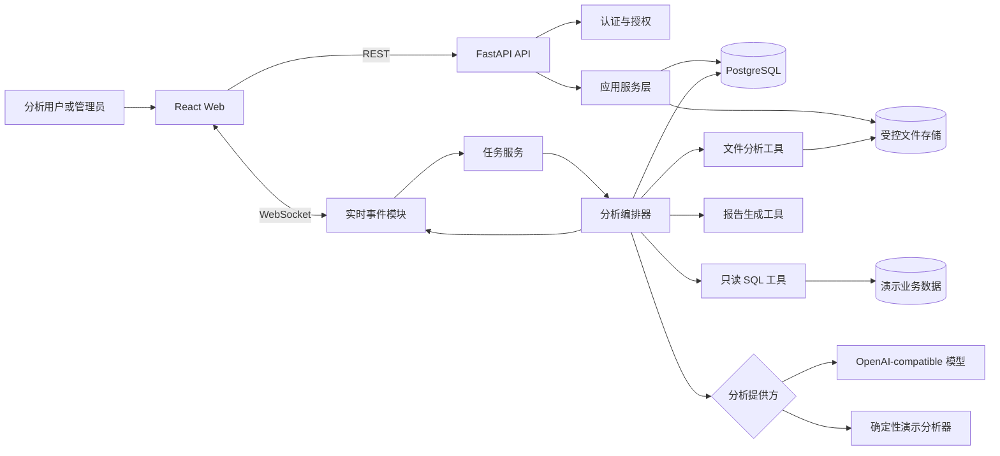
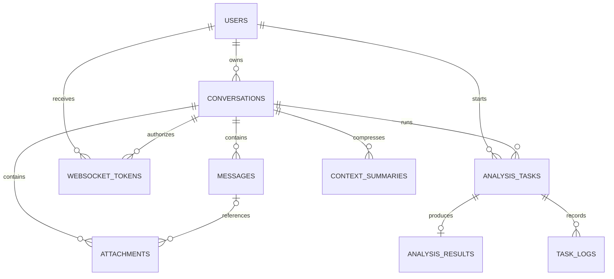
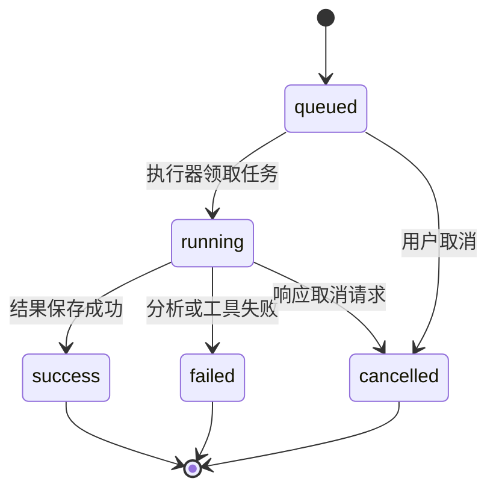

# InsightTrace MVP v1 技术设计

> 文档状态：技术设计初稿
> 对应产品版本：`MVP v1`
> 建立日期：2026-09-16
> 最近更新：2026-09-16
> 上游文档：[PROJECT_PLAN.md](./PROJECT_PLAN.md)

## 1. 文档目的

本文档将已确认的产品范围转换为可以直接指导开发、测试和验收的技术方案。

本设计重点解决：

- 前端、后端、数据库和模型之间如何协作；
- 一条分析请求如何从消息变成任务、事件和最终结果；
- 多轮会话、附件和证据如何保存；
- 如何约束模型生成的 SQL 和文件访问；
- 如何在没有外部模型密钥时稳定完成演示；
- 如何以最小复杂度实现可运行、可复现的 MVP。

## 2. 设计原则

### 2.1 业务原则

1. **证据优先**：结论必须关联指标、查询结果或附件证据。
2. **事实与推断分离**：明确区分已观察事实、相关性判断和原因假设。
3. **人机协作**：系统输出分析建议，不自动修改经营数据或执行经营动作。
4. **上下文连续**：后续追问可以使用之前的问题、结果和会话摘要。
5. **演示可复现**：外部模型不可用时，黄金路径仍然能够稳定运行。

### 2.2 工程原则

1. 采用模块化单体，不在 MVP 中引入微服务拆分。
2. 前后端通过明确的 REST 和 WebSocket 契约协作。
3. 任务状态先写数据库，再向前端发送事件。
4. 所有用户资源访问都经过归属校验。
5. 数据库只读账号是分析查询的最终安全边界。
6. 领域逻辑放在服务层，不直接写在路由或页面组件中。
7. 设计允许后续替换认证、模型和任务执行器，但不提前实现复杂扩展框架。

## 3. 技术栈

| 层级 | 方案 | 版本策略 |
| --- | --- | --- |
| 前端 | React + TypeScript + Vite | 创建骨架时锁定具体版本 |
| 前端路由 | React Router | 使用稳定主版本 |
| 状态和请求 | TanStack Query + 轻量本地状态 | 服务端状态由 Query 管理 |
| 图表 | ECharts | 仅实现指标卡、漏斗图、趋势图 |
| 后端 | Python + FastAPI | Python 3.12，依赖锁定 |
| 数据校验 | Pydantic | 与 FastAPI 兼容版本 |
| ORM | SQLAlchemy 2.x | 使用声明式模型和显式事务 |
| 数据迁移 | Alembic | 所有表结构变更必须迁移 |
| 数据库 | PostgreSQL | Docker Compose 固定主版本 |
| 文件分析 | Pandas + openpyxl | CSV/XLSX/JSON/TXT |
| 模型接口 | OpenAI-compatible API | 通过适配器和环境变量配置 |
| 实时通信 | WebSocket | JSON 事件协议 |
| 后端测试 | Pytest | 单元、集成和接口测试 |
| 前端测试 | Vitest + Testing Library | 组件和状态测试 |
| 端到端测试 | Playwright | 覆盖黄金路径 |
| 部署 | Docker Compose | 前端、后端和 PostgreSQL |

## 4. 总体架构

InsightTrace MVP 采用三层模块化单体架构：React 前端、FastAPI 后端和 PostgreSQL 数据库。文件保存在受控本地存储目录中，模型和演示分析器通过统一接口接入分析编排层。



### 4.1 部署单元

MVP 包含三个必需容器：

- `frontend`：静态前端和反向代理；
- `backend`：REST、WebSocket、任务执行和文件处理；
- `postgres`：系统数据及演示业务数据。

MVP 不引入 Redis、Celery 和独立对象存储。任务由单个后端进程中的异步执行器管理。

这一选择意味着：

- 后端 MVP 只运行一个应用 worker；
- 正在运行的任务不会跨进程迁移；
- 后端重启时，残留的 `queued` 或 `running` 任务会被标记为 `failed`；
- 后续需要多实例时，再引入持久化任务队列和共享事件系统。

## 5. 代码目录设计

```text
InsightTrace/
├── frontend/
│   ├── src/
│   │   ├── api/                 # REST 客户端和数据类型
│   │   ├── auth/                # 登录状态和回调处理
│   │   ├── components/          # 通用组件
│   │   ├── features/
│   │   │   ├── conversations/  # 会话列表和操作
│   │   │   ├── chat/           # 消息区、输入和流式渲染
│   │   │   ├── attachments/    # 附件管理
│   │   │   ├── tasks/          # 实时任务状态
│   │   │   ├── results/        # 结构化结果和图表
│   │   │   └── admin/          # 配置与日志
│   │   ├── hooks/
│   │   ├── pages/
│   │   ├── routes/
│   │   ├── stores/              # 仅保存必要的客户端状态
│   │   └── tests/
│   ├── Dockerfile
│   └── package.json
├── backend/
│   ├── app/
│   │   ├── api/                 # 路由与请求响应模型
│   │   ├── core/                # 配置、安全、日志、错误
│   │   ├── db/                  # 会话、基类和迁移辅助
│   │   ├── models/              # SQLAlchemy 模型
│   │   ├── schemas/             # Pydantic DTO
│   │   ├── repositories/        # 数据访问
│   │   ├── services/            # 领域和应用服务
│   │   ├── analysis/
│   │   │   ├── orchestrator.py  # 分析流程编排
│   │   │   ├── context.py       # 上下文构建与摘要
│   │   │   ├── providers/       # 模型与演示分析器适配器
│   │   │   └── prompts/         # 版本化提示词
│   │   ├── tools/
│   │   │   ├── sql_readonly.py
│   │   │   ├── file_reader.py
│   │   │   ├── text_search.py
│   │   │   ├── metrics.py
│   │   │   └── report_writer.py
│   │   ├── realtime/            # WebSocket、事件和连接管理
│   │   ├── tasks/               # 状态机、执行器和取消控制
│   │   └── main.py
│   ├── alembic/
│   ├── tests/
│   │   ├── unit/
│   │   ├── integration/
│   │   └── contract/
│   ├── Dockerfile
│   └── pyproject.toml
├── database/
│   ├── init/
│   └── seeds/
├── demo-data/
│   ├── catalog-optimization/
│   └── customer-behavior/
├── docs/
│   ├── api/
│   ├── demos/
│   └── screenshots/
├── storage/
│   ├── uploads/.gitkeep
│   ├── exports/.gitkeep
│   └── workspace/.gitkeep
├── tests/
│   └── e2e/
├── .env.example
├── .gitignore
├── docker-compose.yml
├── README.md
├── PROJECT_PLAN.md
└── TECHNICAL_DESIGN.md
```

生成的附件、导出文件和临时文件不提交到 Git，只保留目录占位文件。

## 6. 核心领域对象

### 6.1 对象关系



### 6.2 主键和时间规范

- 业务主键统一使用 UUID；
- 数据库时间统一存储 UTC；
- API 时间使用 ISO 8601，并携带时区；
- 前端按浏览器时区展示；
- `created_at`、`updated_at` 由服务端生成；
- 消息顺序由会话内单调递增的 `seq_no` 保证，不依赖时间排序。

### 6.3 核心表设计

#### `users`

| 字段 | 类型 | 约束或说明 |
| --- | --- | --- |
| id | UUID | 主键 |
| external_user_id | varchar(128) | 唯一，认证提供方用户标识 |
| username | varchar(128) | 唯一 |
| display_name | varchar(128) | 展示名称 |
| role | varchar(32) | `analyst` / `admin` |
| status | varchar(32) | `active` / `disabled` |
| created_at | timestamptz | 创建时间 |
| updated_at | timestamptz | 更新时间 |

#### `conversations`

| 字段 | 类型 | 约束或说明 |
| --- | --- | --- |
| id | UUID | 主键 |
| user_id | UUID | 外键 `users.id`，建立索引 |
| title | varchar(200) | 非空 |
| status | varchar(32) | `active` / `archived` / `deleted` |
| last_message_at | timestamptz | 列表排序使用，可空 |
| created_at | timestamptz | 创建时间 |
| updated_at | timestamptz | 更新时间 |

默认查询不返回 `deleted` 会话。删除操作在一个数据库事务中删除关联记录，事务提交后再清理文件目录；文件清理失败需要写入错误日志并允许后续补偿。

#### `messages`

| 字段 | 类型 | 约束或说明 |
| --- | --- | --- |
| id | UUID | 主键 |
| conversation_id | UUID | 外键并建立索引 |
| role | varchar(32) | `user` / `assistant` / `system` / `tool` |
| message_type | varchar(32) | `text` / `status` / `tool` / `error` |
| content | text | 消息正文 |
| tool_name | varchar(100) | 工具消息可用 |
| tool_status | varchar(32) | `started` / `success` / `failed` |
| seq_no | bigint | 会话内唯一 |
| created_at | timestamptz | 创建时间 |

唯一约束：`(conversation_id, seq_no)`。

#### `attachments`

除原始要求字段外，增加：

- `stored_name`：服务端生成的实际文件名；
- `sha256`：文件完整性和重复检测；
- `parse_error`：解析失败原因；
- `deleted_at`：附件逻辑删除时间。

`file_path` 保存相对于存储根目录的路径，不保存任意绝对路径。

#### `analysis_tasks`

除原始要求字段外，增加：

- `cancel_requested_at`：取消请求时间；
- `analysis_mode`：`model` / `demo`；
- `input_payload_json`：附件 ID、场景、分析模式等任务输入快照；
- `retry_of_task_id`：重试来源任务 ID，可空；
- `version`：乐观锁版本号；
- `created_at`：任务创建时间。

需要数据库约束或事务锁保证同一会话至多存在一个 `queued` 或 `running` 任务。

#### `analysis_results`

JSON 字段使用 PostgreSQL `jsonb`：

- `key_metrics_json`；
- `evidence_list_json`。

增加：

- `result_version`：结果结构版本，MVP 为 `1`；
- `generated_by`：`model` / `demo`；
- `confidence`：整体可信度，可空；
- `updated_at`：重新生成结果时使用。

#### `context_summaries`

- 同一个会话的摘要区间不得重叠；
- `start_seq_no` 和 `end_seq_no` 均包含边界；
- 摘要必须记录事实、已确认口径、历史结论和未解决问题；
- 摘要不能替代原始消息，原始消息仍然保留。

#### `websocket_tokens`

- 数据库只保存令牌哈希，不保存明文令牌；
- 默认有效期 60 秒；
- 首次连接后写入 `consumed_at`；
- 令牌绑定用户和会话；
- 已使用、过期或归属不匹配的令牌必须拒绝。

#### `system_configs`

配置值分为：

- 可以存数据库并热更新的非敏感配置；
- 只能通过环境变量提供的敏感配置。

模型密钥、数据库密码和签名密钥不得写入 `system_configs`。

#### `task_logs`

增加 `sequence_no`，保证任务内日志顺序。`log_content` 只保存摘要，不保存密钥、完整令牌或大段原始业务数据。

### 6.4 演示业务数据

演示表与系统表隔离：

- `demo_catalog` schema：商品目录优化数据；
- `demo_customer` schema：客户行为分析数据；
- 后端分析连接使用单独的只读数据库账号；
- 只读账号仅能访问这两个 schema 的白名单表；
- 应用事务账号不交给分析工具使用。

## 7. 认证与授权设计

### 7.1 MVP 认证流程

1. 前端访问 `GET /auth/login`；
2. 后端跳转到内置的模拟授权页面；
3. 用户选择演示身份；
4. 模拟授权端生成一次性授权码并回调 `GET /auth/callback`；
5. 后端校验授权码、创建或更新用户；
6. 后端签发短期访问会话并写入 `HttpOnly`、`SameSite=Lax` Cookie；
7. 浏览器跳转到聊天工作台；
8. 前端通过 `GET /api/me` 获取当前用户信息。

前端不把访问令牌保存到 `localStorage`。未来接入真实认证中心时，只替换认证提供方适配器和回调交换逻辑。

### 7.2 授权规则

- 分析用户只能访问属于自己的会话及关联资源；
- 管理员可以访问管理接口，但默认不能读取其他用户附件正文；
- 所有根据资源 ID 查询的接口都必须同时带上当前用户归属条件；
- 不能先查出资源再在业务层判断归属，避免资源存在性泄露；
- 管理接口统一检查 `admin` 角色。

## 8. REST API 契约

### 8.1 通用约定

- API 前缀：`/api`；
- 请求和响应使用 JSON，文件上传和下载除外；
- UUID 使用字符串表示；
- 时间使用 ISO 8601；
- 列表默认按最近更新时间倒序；
- 删除、取消等重复请求应尽可能保持幂等；
- OpenAPI 文档由 FastAPI 自动生成，并作为接口契约校验来源。

成功响应直接返回业务对象。错误响应统一为：

```json
{
  "error": {
    "code": "CONVERSATION_BUSY",
    "message": "当前会话已有运行中的分析任务",
    "details": {},
    "request_id": "9ba0b02f-74bd-48ae-8962-dc6cc9acba76"
  }
}
```

### 8.2 错误码

| 错误码 | HTTP 状态 | 含义 |
| --- | --- | --- |
| `UNAUTHENTICATED` | 401 | 未登录或登录失效 |
| `FORBIDDEN` | 403 | 权限不足 |
| `RESOURCE_NOT_FOUND` | 404 | 资源不存在或不属于当前用户 |
| `VALIDATION_ERROR` | 422 | 请求字段错误 |
| `CONVERSATION_BUSY` | 409 | 会话已有活动任务 |
| `CONVERSATION_ARCHIVED` | 409 | 会话已归档，不能继续写入消息 |
| `TASK_NOT_CANCELLABLE` | 409 | 任务当前不能取消 |
| `FILE_TYPE_NOT_ALLOWED` | 415 | 文件格式不支持 |
| `FILE_TOO_LARGE` | 413 | 文件超过限制 |
| `SQL_REJECTED` | 400 | 查询不满足只读安全规则 |
| `QUERY_TIMEOUT` | 408 | 查询超时 |
| `ANALYSIS_FAILED` | 500 | 分析任务失败 |

### 8.3 认证接口

| 方法与路径 | 用途 |
| --- | --- |
| `GET /auth/login` | 发起授权登录 |
| `GET /auth/mock/authorize` | 展示内置模拟授权页面 |
| `POST /auth/mock/authorize` | 选择演示身份并签发一次性授权码 |
| `GET /auth/callback` | 处理授权回调 |
| `POST /auth/logout` | 清除登录态 |
| `GET /api/me` | 获取当前用户 |

### 8.4 会话接口

#### `POST /api/conversations`

请求：

```json
{"title": "分析本月商品转化下降原因"}
```

响应：

```json
{
  "id": "uuid",
  "title": "分析本月商品转化下降原因",
  "status": "active",
  "created_at": "2026-09-16T08:00:00Z"
}
```

#### 其他会话接口

| 方法与路径 | 说明 |
| --- | --- |
| `GET /api/conversations` | 查询当前用户会话列表 |
| `GET /api/conversations/{conversation_id}` | 查询消息、附件摘要和最近结果 |
| `PATCH /api/conversations/{conversation_id}` | 修改标题或状态 |
| `DELETE /api/conversations/{conversation_id}` | 删除会话 |

`PATCH /api/conversations/{conversation_id}` 请求：

```json
{
  "title": "新的标题",
  "status": "archived"
}
```

删除接口不接收资源归属信息；后端必须使用路径中的会话 ID 与当前用户 ID
共同查询目标会话，防止删除其他用户的资源。

#### 会话消息接口

| 方法与路径 | 说明 |
| --- | --- |
| `GET /api/conversations/{conversation_id}/messages` | 按消息序号读取历史消息 |
| `POST /api/conversations/{conversation_id}/messages` | 保存一条用户文本消息 |

消息创建时先锁定属于当前用户的会话记录，再计算下一条消息序号，避免同一会话
中的并发写入得到重复序号。其他用户访问时统一返回 `RESOURCE_NOT_FOUND`。

### 8.5 附件接口

| 方法与路径 | 说明 |
| --- | --- |
| `POST /api/attachment/upload` | 使用 multipart 上传文件 |
| `POST /api/attachment/delete` | 删除附件 |
| `GET /api/attachment/get?attachment_id={id}` | 下载附件 |
| `GET /api/attachment/ls?conversation_id={id}` | 查询会话附件 |

上传成功只代表文件已保存。解析状态可能依次为：

- `pending`
- `parsing`
- `success`
- `failed`

### 8.6 分析任务接口

#### `POST /api/tasks`

请求：

```json
{
  "conversation_id": "uuid",
  "input_text": "为什么本月商品转化率下降？",
  "attachment_ids": ["uuid"],
  "analysis_mode": "demo"
}
```

服务端在一个事务中完成：

1. 校验会话归属和状态；
2. 检查会话是否存在活动任务；
3. 保存用户消息；
4. 创建 `queued` 任务；
5. 更新会话最近消息时间。

响应：

```json
{
  "task_id": "uuid",
  "conversation_id": "uuid",
  "task_status": "queued",
  "websocket_required": true
}
```

其他任务接口：

| 方法与路径 | 说明 |
| --- | --- |
| `GET /api/tasks/{task_id}` | 查询持久化任务状态 |
| `POST /api/tasks/{task_id}/cancel` | 请求取消任务 |
| `POST /api/tasks/{task_id}/retry` | 根据原输入快照创建新的重试任务 |
| `GET /api/tasks/{task_id}/logs` | 查询任务日志摘要 |

### 8.7 实时令牌与结果接口

| 方法与路径 | 说明 |
| --- | --- |
| `POST /api/chat/ws-token` | 为指定会话签发一次性令牌 |
| `WS /api/chat/ws/chat` | 订阅会话任务事件 |
| `GET /api/results/{task_id}` | 获取结构化分析结果 |
| `POST /api/results/{task_id}/export` | 生成或获取 Markdown 报告 |
| `GET /api/results/{task_id}/download` | 下载结果文件 |

### 8.8 管理接口

| 方法与路径 | 说明 |
| --- | --- |
| `GET /api/admin/configs` | 查看可公开配置 |
| `POST /api/admin/reload` | 重新加载非敏感配置 |
| `GET /api/admin/health` | 查看组件状态 |
| `GET /api/admin/tasks` | 查询任务和错误摘要 |

## 9. WebSocket 事件协议

### 9.1 连接

连接地址：

```text
/api/chat/ws/chat?websocket_token={token}&conversation_id={conversation_id}
```

连接建立后，服务端首先发送 `connected` 事件。客户端以 `seq_no` 去重和排序。

### 9.2 通用事件结构

```json
{
  "event_id": "uuid",
  "event_type": "task_status",
  "task_id": "uuid",
  "conversation_id": "uuid",
  "seq_no": 4,
  "timestamp": "2026-09-16T08:00:02Z",
  "payload": {}
}
```

`seq_no` 在单个任务内单调递增。事件用于实时体验，数据库中的任务和结果状态才是最终事实来源。

### 9.3 事件类型

| 事件 | 主要 payload 字段 |
| --- | --- |
| `connected` | `connection_id` |
| `message_start` | `message_id` |
| `message_delta` | `message_id`, `delta_text` |
| `tool_start` | `tool_call_id`, `tool_name`, `summary` |
| `tool_finish` | `tool_call_id`, `tool_name`, `status`, `result_summary` |
| `task_status` | `task_status`, `current_step` |
| `result_ready` | `result_id`, `result_version` |
| `error` | `error_code`, `error_message`, `retryable` |
| `done` | `final_status`, `finished_at` |

工具事件不向前端发送数据库密码、完整 SQL 参数、绝对文件路径或附件完整内容。

### 9.4 断线恢复

MVP 不保存全部 WebSocket 事件用于重放。断线后：

1. 前端重新申请 WebSocket 令牌并连接；
2. 调用 `GET /api/tasks/{task_id}` 恢复任务状态；
3. 任务成功时调用 `GET /api/results/{task_id}`；
4. 调用会话详情接口恢复已持久化消息。

## 10. 分析任务状态机



### 10.1 状态转换规则

- 只有 `queued` 和 `running` 可以取消；
- `success`、`failed`、`cancelled` 为终态；
- 任务进入 `running` 时写入 `started_at`；
- 进入终态时写入 `finished_at`；
- 结果和 `success` 状态必须在同一事务中保存；
- 模型流式文本可以暂存在内存，但最终助手消息必须持久化；
- 取消采用协作式取消：每个工具步骤前后检查取消标志；
- 已经提交到数据库的只读查询不能保证立即中断，需要依赖数据库查询超时或连接取消。

### 10.2 当前步骤

`current_step` 使用稳定枚举：

- `preparing_context`
- `inspecting_sources`
- `querying_data`
- `calculating_metrics`
- `building_evidence`
- `generating_conclusion`
- `saving_result`

前端负责将枚举映射为中文展示文案。

### 10.3 启动恢复

后端启动时查找遗留的 `queued` 和 `running` 任务：

- 尚未开始执行的 `queued` 任务重新进入内存执行队列；
- 已经执行但未完成的 `running` 任务标记为 `failed`；
- 重启失败错误码为 `WORKER_RESTARTED`，并标记为可重试；
- 保留原始问题、输入快照、附件关联、已持久化消息和任务日志；
- 不完整的中间结果不能成为正式分析结果；
- 前端为可重试失败展示“重新分析”操作；
- 重试创建新任务，并通过 `retry_of_task_id` 关联原任务，原任务保持不可修改。

MVP 不自动重试已经进入 `running` 的任务，以避免重复模型费用、重复报告和不确定的中间状态。新任务从完整分析流程起点重新执行。

## 11. 分析编排设计

### 11.1 统一提供方接口

模型模式和演示模式实现相同接口：

```python
class AnalysisProvider(Protocol):
    async def analyze(self, request: AnalysisRequest, tools: ToolRegistry) -> AnalysisOutput:
        ...
```

`AnalysisOutput` 必须通过 Pydantic 结构校验后才能保存。

### 11.2 标准分析流程

1. 加载当前用户、会话和本轮消息；
2. 加载最近消息、有效摘要和最近分析结果；
3. 加载所选附件元数据和解析结果；
4. 判断业务场景及数据源；
5. 执行只读查询或文件统计；
6. 生成关键指标；
7. 将指标与来源转换为证据对象；
8. 生成结论、缺失数据和建议；
9. 验证结构化输出；
10. 保存结果、助手消息和报告；
11. 更新任务终态并发送完成事件。

### 11.3 结构化结果契约

```json
{
  "result_version": 1,
  "problem_definition": "分析本月商品转化率下降的主要原因",
  "key_metrics": [
    {
      "metric_name": "移动端加购率",
      "metric_value": 5.8,
      "metric_unit": "%",
      "metric_period": "2026-08",
      "comparison_value": 9.2,
      "comparison_period": "2026-07",
      "change_rate": -36.96
    }
  ],
  "evidence_list": [
    {
      "evidence_id": "E-001",
      "source_type": "database_query",
      "source_name": "demo_catalog.clicks + conversions",
      "evidence_text": "移动端加购率由 9.2% 降至 5.8%",
      "related_metric": "移动端加购率",
      "confidence": 0.95,
      "fact_level": "observed"
    }
  ],
  "conclusion_text": "主要损耗发生在移动端点击后的加购环节。",
  "missing_data_text": "缺少页面性能和错误日志，暂时不能确认具体技术原因。",
  "next_actions": [
    "检查移动端商品详情页性能和错误率",
    "按应用版本拆分加购率并进行对照"
  ],
  "overall_confidence": 0.86
}
```

`fact_level` 允许：

- `observed`：数据直接观察到的事实；
- `inferred`：由多项证据推断的判断；
- `hypothesis`：需要补充数据验证的原因假设。

### 11.4 上下文策略

MVP 上下文优先级：

1. 当前问题；
2. 当前会话已确认的指标口径；
3. 最近一次结构化结果；
4. 最近若干条原始消息；
5. 更早消息的上下文摘要；
6. 当前有效附件和数据源说明。

摘要只在达到配置阈值时生成，不能因为摘要失败阻塞本轮分析。

## 12. 演示模式设计

演示模式不是硬编码一段固定回答，而是使用真实演示数据执行受控分析。

### 12.1 处理流程

1. 根据问题关键词和当前会话场景识别分析意图；
2. 选择预定义的参数化查询模板；
3. 执行真实只读 SQL；
4. 使用确定性计算函数生成指标和变化率；
5. 根据阈值和规则形成证据、结论和建议；
6. 输出与模型模式相同的结果结构。

### 12.2 支持的首批意图

商品目录优化：

- 整体转化变化；
- 类目转化对比；
- 高曝光低点击商品；
- 点击到加购或下单的漏斗损耗；
- 渠道或设备维度拆解。

客户行为分析：

- 访问、加购、下单漏斗；
- 渠道转化对比；
- 地区或用户分群对比；
- 新老用户行为差异；
- 异常流量来源定位。

无法匹配支持意图时，演示模式明确说明能力范围并提示可用问题，不伪造分析结果。

## 13. 工具与安全设计

### 13.1 只读 SQL 工具

执行前按以下顺序校验：

1. 仅接受单条 SQL；
2. 解析语法树，不使用简单字符串替换作为唯一判断；
3. 只允许 `SELECT` 和只读 CTE；
4. 拒绝 DDL、DML、事务控制、文件和网络相关函数；
5. 校验 schema、表和必要字段白名单；
6. 自动应用最大行数限制；
7. 使用只读账号和只读事务执行；
8. 设置语句超时；
9. 返回结构化列名、行数据、总行数和截断标记；
10. 日志只记录规范化 SQL 摘要和执行统计。

首版禁止模型直接生成并执行不受约束的查询。模型模式应优先使用参数化分析工具；如果允许生成 SQL，也必须通过上述全部检查。

### 13.2 文件工具

- 根据 `attachment_id` 获取文件，不接受任意路径；
- 将存储根路径与相对路径安全拼接并验证解析后的路径仍在根目录；
- 读取前再次检查大小、扩展名和 MIME；
- CSV 采用受控编码探测和最大行列限制；
- XLSX 限制工作表数量、行数和列数；
- JSON 限制嵌套深度和总体大小；
- TXT 限制读取字符数；
- 临时文件仅写入当前用户和会话的 workspace 目录。

### 13.3 初始限制建议

以下数值作为实现默认值，之后可以通过非敏感配置调整：

| 项目 | 默认限制 |
| --- | --- |
| 单个附件 | 20 MB |
| 单会话附件总量 | 100 MB |
| CSV/XLSX 最大数据行 | 100,000 |
| XLSX 最大工作表 | 20 |
| SQL 超时 | 15 秒 |
| SQL 最大返回行 | 2,000 |
| WebSocket 令牌有效期 | 60 秒 |
| 单任务最长时间 | 5 分钟 |

## 14. 文件生命周期

```text
上传请求
  → 校验类型和大小
  → 生成 stored_name
  → 写入 uploads/{user_id}/{conversation_id}/
  → 计算 SHA-256
  → 保存附件记录
  → 解析并更新 parse_status
```

导出文件保存至：

```text
exports/{user_id}/{conversation_id}/{task_id}/report.md
```

临时文件保存至：

```text
workspace/{user_id}/{conversation_id}/{task_id}/
```

任务进入终态后清理对应临时目录。删除会话时清理会话的上传、导出和临时目录。

## 15. 前端设计

### 15.1 工作台布局

```text
┌──────────────┬────────────────────────────┬──────────────────────┐
│ 会话列表     │ 消息与输入                 │ 分析与证据           │
│              │                            │                      │
│ 新建         │ 历史消息                   │ 任务进度             │
│ 搜索         │ 流式回答                   │ 工具执行摘要         │
│ 重命名       │ 附件选择                   │ 指标/漏斗/趋势       │
│ 归档/删除    │ 输入框与取消按钮           │ 证据/结论/建议       │
└──────────────┴────────────────────────────┴──────────────────────┘
```

窄屏时右侧结果区改为抽屉或标签页，不做移动端专项设计。

### 15.2 状态归属

- TanStack Query：用户、会话、消息、附件、任务、结果；
- 轻量本地状态：当前会话 ID、右侧面板标签、草稿输入；
- WebSocket 增量文本：任务期间存内存，完成后以服务端持久化消息为准；
- URL 保存当前会话 ID，刷新后可以恢复。

### 15.3 可视化规则

- 指标卡：展示当前值、对比值和变化率；
- 漏斗图：仅用于具备明确阶段顺序的数据；
- 趋势图：必须标注时间粒度、指标单位和对比区间；
- 图表必须可以切换或查看对应表格数据；
- 不根据不完整数据绘制误导性因果图。

## 16. 日志、监控与配置

### 16.1 日志

应用日志采用结构化 JSON，至少包含：

- `timestamp`
- `level`
- `request_id`
- `user_id`，必要时脱敏
- `conversation_id`
- `task_id`
- `component`
- `event`
- `duration_ms`
- `error_code`

不得记录：

- 密码和模型密钥；
- 明文访问令牌或 WebSocket 令牌；
- Cookie；
- 附件完整内容；
- 超出排查需要的完整业务数据行。

### 16.2 健康检查

- `GET /health/live`：进程存活；
- `GET /health/ready`：数据库连接、迁移状态和存储目录可用；
- 管理健康页显示模型配置状态，但不显示密钥。

模型不可用不应让基础服务失去 ready 状态；前端应显示模型模式不可用并允许切换演示模式。

### 16.3 配置层级

优先级从高到低：

1. 环境变量中的敏感和部署配置；
2. 数据库中的可热更新非敏感配置；
3. 应用默认值。

热更新只影响新任务，不改变已经运行中的任务快照。

## 17. 测试策略

### 17.1 单元测试

- 任务状态转换；
- SQL 安全检查；
- 文件路径校验；
- 指标计算；
- 证据可信度和事实层级校验；
- 演示模式意图匹配；
- 结果结构验证。

### 17.2 集成测试

- 认证回调和会话建立；
- 会话及消息事务；
- 附件上传、解析和删除；
- 活动任务唯一约束；
- 分析结果事务保存；
- WebSocket 令牌一次性消费；
- 用户资源隔离；
- 会话删除及文件清理。

### 17.3 契约测试

- REST 响应符合 OpenAPI；
- WebSocket 事件符合版本化 JSON Schema；
- 模型输出符合 `AnalysisOutput`；
- 演示模式与模型模式输出结构一致。

### 17.4 端到端测试

至少覆盖：

1. 登录到工作台；
2. 创建会话；
3. 上传示例文件；
4. 发起商品目录分析；
5. 查看任务事件；
6. 查看六部分结果和图表；
7. 继续追问；
8. 导出 Markdown；
9. 刷新并恢复历史；
10. 删除会话并确认资源不可访问。

## 18. 首条黄金路径

### 18.1 业务问题

```text
为什么 2026 年 8 月商品目录的整体转化率较 7 月下降？
```

### 18.2 预设数据原因链

演示数据需要支持以下可验证链路：

1. 整体访问或曝光没有显著下降；
2. 移动端商品详情页流量上升；
3. 移动端点击到加购环节明显下降；
4. 损耗集中在部分高流量商品或应用版本；
5. 数据只能确认损耗位置，不能在缺少性能日志时直接确认技术根因；
6. 系统提出补充页面性能和错误日志的建议。

### 18.3 系统链路

```text
模拟 OAuth 登录
  → 创建会话
  → 选择商品目录演示数据源
  → 提交问题
  → 创建用户消息和 queued 任务
  → 签发并消费 WebSocket 令牌
  → 任务进入 running
  → 执行整体、设备和商品维度查询
  → 计算转化率及变化贡献
  → 生成证据和结构化结果
  → 保存助手消息和 Markdown 报告
  → 任务进入 success
  → 页面展示指标卡、漏斗、证据和建议
```

### 18.4 后续追问

```text
具体是哪些商品对下降贡献最大？
```

系统需要继承上一轮的时间范围、指标口径和设备维度，无需用户重复说明。

## 19. 实施顺序

### 阶段 A：可启动骨架

1. 创建目录和依赖清单；
2. 建立 Docker Compose；
3. 建立后端 `/health/live` 和 `/health/ready`；
4. 建立前端空工作台；
5. 建立 PostgreSQL 和 Alembic；
6. 建立 CI 可执行的测试命令。

完成标准：三个容器可启动，前端能显示后端和数据库健康状态。

### 阶段 B：持久化业务骨架

1. 实现用户、会话、消息、任务和结果表；
2. 实现模拟 OAuth；
3. 实现会话和消息 API；
4. 实现用户资源隔离；
5. 完成基础工作台交互。

### 阶段 C：黄金路径

1. 导入商品目录演示数据；
2. 实现任务执行器；
3. 实现 WebSocket 事件；
4. 实现演示分析器和只读查询；
5. 实现结构化结果展示；
6. 实现 Markdown 报告。

### 阶段 D：补齐 MVP

1. 附件管理；
2. 任务取消和断线恢复；
3. 多轮上下文摘要；
4. 客户行为分析场景；
5. 管理配置和日志；
6. 安全、集成和端到端测试；
7. 文档、截图和交付整理。

## 20. 当前技术决策

| 编号 | 状态 | 决策 |
| --- | --- | --- |
| T-001 | 已确认 | MVP 采用 React、TypeScript、FastAPI、PostgreSQL 和 Docker Compose |
| T-002 | 已确认 | MVP 采用模块化单体，不拆分微服务 |
| T-003 | 已确认 | 任务在单个后端进程中异步执行，不引入 Redis 和 Celery |
| T-004 | 已确认 | 模拟 OAuth 内置在后端，通过提供方接口预留真实认证接入 |
| T-005 | 已确认 | 浏览器登录态使用 HttpOnly Cookie，不把访问令牌写入 localStorage |
| T-006 | 已确认 | 模型模式与演示模式使用同一结构化输出契约 |
| T-007 | 已确认 | 演示模式执行真实演示数据查询，不返回纯硬编码答案 |
| T-008 | 已确认 | 系统事务账号和分析只读账号分离 |
| T-009 | 已确认 | WebSocket 用于实时体验，数据库状态作为最终事实来源 |
| T-010 | 已确认 | MVP 只支持单后端 worker，重启后活动任务标记失败 |

## 21. 仍需在实现前锁定的参数

以下事项不阻止建立项目骨架，但需要在对应模块开发前确定：

1. 前后端各依赖的精确版本；
2. 默认 OpenAI-compatible 模型名称、超时和最大输出；
3. 是否允许用户在界面选择 `model` 或 `demo` 模式；
4. PostgreSQL 容器的固定主版本；
5. 文件和查询限制是否采用第 13.3 节建议值；
6. 商品目录演示表的最终字段和样例数据规模；
7. 前端视觉风格和品牌色。

## 22. 技术设计完成标准

满足以下条件后，可以认为技术设计已经冻结并进入项目骨架开发：

- [x] 产品负责人确认总体架构和模块边界；
- [x] 确认模块化单体与单 worker 限制；
- [x] 确认认证和登录态方案；
- [x] 确认核心数据表和删除策略；
- [x] 确认 REST 与 WebSocket 通用契约；
- [x] 确认演示模式不是固定回答，而是执行真实演示数据分析；
- [x] 确认首条黄金路径及预设原因链；
- [x] 默认文件与查询限制暂采用第 13.3 节建议值，实现时可通过配置调整；

确认后如需修改架构、协议或数据边界，应在本文档中保留变更记录，并同步评估数据库迁移、接口兼容和测试影响。

## 23. 变更记录

| 日期 | 版本 | 变更 |
| --- | --- | --- |
| 2026-09-16 | 0.1 | 建立 MVP v1 技术设计初稿 |
| 2026-09-16 | 0.2 | 技术设计确认；补充任务重启恢复、输入快照与人工重试设计 |
| 2026-09-16 | 0.3 | 完成核心模型与首版迁移；明确应用 schema 和连接搜索路径策略 |
| 2026-09-16 | 0.4 | 完成模拟 OAuth、Cookie 会话、角色识别和认证错误响应实现 |
| 2026-09-17 | 0.5 | 完成会话创建和列表首个闭环；会话接口统一为 RESTful 资源路径 |
| 2026-09-17 | 0.6 | 完成用户消息保存、历史回放、连续序号和会话级资源隔离 |
| 2026-09-17 | 0.7 | 完成会话重命名、归档、恢复、级联删除和文件目录清理 |
| 2026-09-17 | 0.8 | 完成工程规范整改：移除默认密钥、隔离测试数据库并增强全新数据库迁移能力 |
