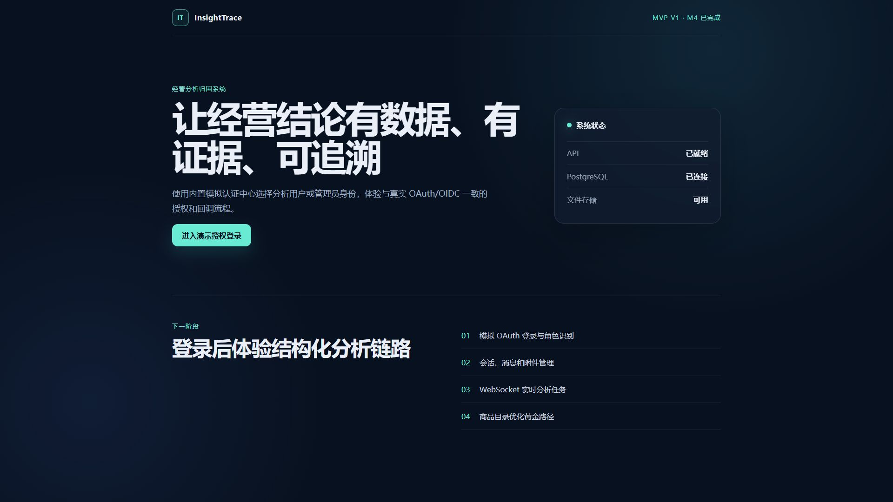
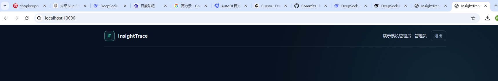

# InsightTrace M5 验收报告

> 验收日期：2026-09-18；验收结论：通过

## 验收环境

- Python 3.12 后端测试镜像；
- PostgreSQL 17 Alpine 独立测试数据库；
- Node.js 22 前端构建环境；
- 独立 Docker 网络和容器，未改动用户已有的本地数据。

## 功能验收

| 验收项 | 结果 | 主要证据 |
| --- | --- | --- |
| 模拟 OAuth 登录和角色识别 | 通过 | `test_auth.py`，管理员页面截图 |
| 会话创建、重命名、切换、归档和删除 | 通过 | `test_conversations.py`，前端组件测试 |
| 附件上传、解析、列表、下载和删除 | 通过 | `test_attachments.py` |
| 任务创建、状态、取消和重试 | 通过 | `test_tasks.py`、`test_task_lifecycle.py` |
| WebSocket 状态、工具和增量文本事件 | 通过 | `test_realtime.py`、`test_task_executor.py` |
| 历史上下文和多轮追问 | 通过 | `test_analysis_context.py`、`test_analysis_scenarios.py` |
| 六部分结果、Markdown 导出和下载 | 通过 | `test_results.py` |
| 管理员健康、配置重载和日志 | 通过 | `test_admin.py`，管理员页面截图 |
| 商品目录和客户行为场景 | 通过 | `test_catalog_analysis.py`、`test_behavior_analysis.py` |

## 安全边界验收

| 验收项 | 结果 | 主要证据 |
| --- | --- | --- |
| 写入型、多语句、越权表和危险函数 SQL 拒绝 | 通过 | `test_sql_readonly.py` |
| SQL 语句超时和返回行上限 | 通过 | `test_sql_readonly.py` |
| 会话、附件、任务和结果的用户隔离 | 通过 | 各资源集成测试 |
| 非法类型、超大文件和路径穿越拒绝 | 通过 | `test_attachments.py`、`test_attachment_storage.py` |
| 同一会话活动任务唯一性 | 通过 | `test_tasks.py`、数据库部分唯一索引 |
| WebSocket 过期和重放令牌拒绝 | 通过 | `test_realtime.py` |
| 删除会话后级联删除记录并清理文件 | 通过 | `test_results.py` |
| 密码、令牌、API Key 和已知密钥日志脱敏 | 通过 | `test_redaction.py`、`test_admin.py` |

## 自动化结果

- 后端：59 项 pytest 测试通过；
- 后端质量：Ruff 检查通过；
- 前端：3 项 Vitest 测试通过；
- 前端产物：TypeScript 类型检查和 Vite 生产构建通过。

## 截图

### 服务就绪首页

### 管理员已登录

## 结论

MVP v1 的 M0–M5 已形成可重复启动、可稳定演示、有自动化证据且安全边界明确的本地闭环。
真实外部 OAuth/OIDC 和模型推理仍属于 MVP 之后的产品化工作。
